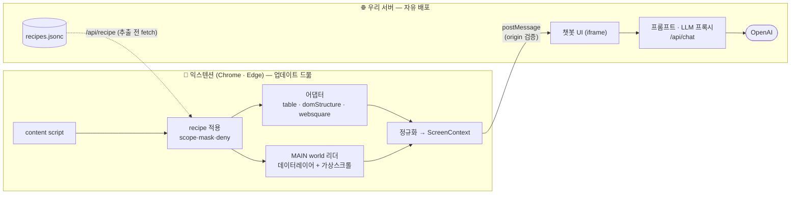
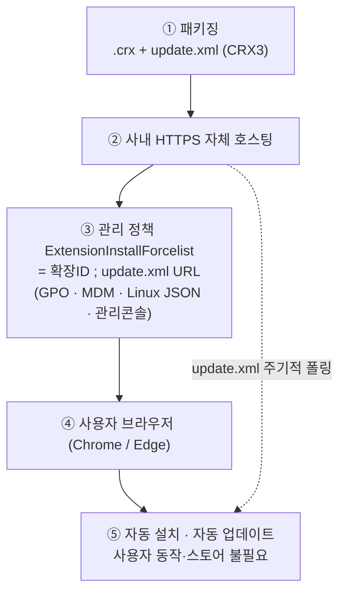

# 아키텍처 v0.2 — 브라우저 익스텐션 + 플러그러블 어댑터 (현재 구현)

> 이 문서는 **현재 구현된 시스템(as-built)**의 상세 스펙이다.
> 향후 방향(채널/AI 서비스/PoC 데모)은 [v0.3-direction.md](v0.3-direction.md) 참고.
> 항상 지켜야 할 규칙·컨벤션 요약은 루트 [`CLAUDE.md`](../../CLAUDE.md).

---

## 1. 개요

웹 화면의 **비즈니스 데이터(표·차트·카드)를 근거로 답하는 화면-인지형 챗봇** PoC.
- 챗봇은 **"지금 그 화면에 떠 있는 데이터"만 근거로** 답한다.
- 개발 Python, LLM OpenAI. 목표는 PoC — **단순함 우선**(과한 추상화 금지).

### 왜 이 구조인가 (가장 중요)
**핵심 고객 제약:** "기존 레거시 코드를 수정하면서 챗봇을 연결하고 싶지 않다."
→ 화면이 데이터를 넘기려면 레거시 수정 필요 → 제약 위반. 그래서 **레거시 무수정** 방향:
크롬 익스텐션이 ① 화면을 인식 ② 데이터를 추출 ③ 챗봇 UI에서 답한다.

**확장된 요구:** 특정 UI 툴 전용이 아니라 **WebSquare/React/Vue/일반 HTML 등 어떤 화면에서도** 동작 → **플러그러블 어댑터**.

| 기준 | 데이터 주입(레거시 수정) | 익스텐션이 화면 인식 |
|---|---|---|
| 레거시 코드 수정 | 필요 ← **제약 위반** | 불필요 ← **제약 충족** |
| 데이터 완전성 | 데이터모델=전체 | 단순 DOM 스크래핑은 "보이는 행"만 |
| 범용성 | 화면마다 연동 | 임의 페이지에 동작 |

DOM 스크래핑의 데이터 완전성 약점은 **데이터 레이어 직접 읽기 + 가상스크롤 폴백**으로 보완(§3.4).

---

## 2. 기술 스택

- **언어/런타임**: Python 3.12, **uv**(`pyproject.toml`+`uv.lock`+`.venv`, pip 미사용)
- **서버**: FastAPI(챗봇 UI 제공 + `/api/chat` LLM 프록시)
- **LLM**: OpenAI(`.env`로 키/모델 주입, 하드코딩 금지)
- **챗봇 UI**: 순수 HTML/CSS/JS + `marked`
- **익스텐션**: Manifest V3(service worker, content scripts, Side Panel API) — **Chrome·Edge 모두 호환**(둘 다 Chromium MV3, 코드 변경 불필요. 상세 §9.3)
- **테스트**: Node + **Playwright**(실제 Chromium 브라우저 테스트) + 파이썬 단독 테스트. 제너릭 러너 → `tests/RESULTS.md` (`node tests/run.mjs`). 상세는 §10.

---

## 3. 아키텍처

### 3.1 큰 그림

익스텐션이 화면을 **공통 형식 ScreenContext**(tables/sections/charts)로 만들고, 서버·LLM은 그 형식만 다룬다 → 화면이 무엇이든 뒷단 동일.

### 3.2 플러그러블 어댑터 패턴 (핵심)
1. **감지(detect)**: DOM/전역 단서로 화면 유형 판정(결정론적). 별도 "도메인 강제 매핑"은 두지 않는다. 최하위 `domStructure`는 `detect()`가 항상 참이라 **구조화는 늘 시도**되고, 그래도 못 잡은 텍스트는 맨 마지막 **text 폴백**이 담아 **빈손은 진짜 빈 화면에서만**.
   - React: 노드의 `__reactFiber$…`/`__reactProps$…`, `__REACT_DEVTOOLS_GLOBAL_HOOK__`
   - Vue: `__vue_app__`(v3)/`__vue__`(v2), `data-v-` 속성
   - WebSquare: 전역 `WebSquare`/`$w`/`scwin`, 그리드 클래스(`w2grid` 등)
   - 일반 HTML: 위 단서 없음 → `<table>`/`role="grid"` 제네릭(폴백)
2. **추출(extract)**: 어댑터가 데이터를 꺼내 **ScreenContext**로 변환(출력 형태 동일 → 이후 공통).
3. 인터페이스 `{ name, priority, detect(node)->bool, extract(node, claimed)->{tables,sections,claimed} }`. 레지스트리(`content/base.js UDC.run`)가 priority 순으로 detect→extract, **점유 안 된 나머지를 채움(merge)**.

#### 추출 계층 (신뢰도 높은 순, 위에서부터 시도 → 병합)
전제: **실제 화면은 라벨이 DOM에 있다.** 핵심은 "데이터 위치를 찾아 라벨과 매핑", 대부분 어댑터로 끝난다.

| 단계 | 무엇 | 위치 |
|---|---|---|
| **picked** | 사용자가 🎯로 지정한 영역 최우선 | `base.js`(`pickedSelector`) |
| **table** | `<table>` thead/tbody → 데이터 + `<th>` 라벨 | `adapters/table.js` |
| **domStructure**(제네릭) | div 반복구조로 데이터 영역 찾고 헤더행/라벨-값 매핑. **항상 동작하는 최하위 어댑터**(구조화 폴백) | `adapters/dom-structure.js` |
| **데이터레이어**(MAIN world) | 페이지 전역(`window.GRID`류·`Chart.instances`)을 `executeScript({world:"MAIN"})`로 읽음 → **가상스크롤 전체 + 컬럼정의 라벨 + 차트** | `background.js readDataLayer` |
| **recipe** | 도메인별 콘텐츠영역(scope) + 접근·거버넌스 힌트(§4) | `recipes.jsonc` |
| **text 폴백** | 앞 단계가 못 잡은 **보이는 텍스트**까지 담는 **최종 폴백** → `sections kind=text`(상한 30k). 여기서도 비면 빈 화면 | `base.js collectVisibleText` |

- **병합**: 표·차트=MAIN(전체) 우선, 카드·텍스트=ISOLATED. `source="dataLayer+table+domStructure+text"`처럼 표기.
- **가시성 필터**(`UDC.isVisible`): `display:none`·`visibility:hidden`·`opacity:0`·크기 0 제외 → **현재 보이는 뷰만**. SPA 탭/슬라이드처럼 URL 안 바뀌고 보임/숨김만 바뀌는 화면도 현재 뷰만 읽음. (오프스크린 transform 등 일부 기법은 미감지 — 필요 시 뷰포트 교차 검사로 보강)
- **텍스트 폴백**: 구조화로 못 잡은 나머지 텍스트를 담아 "추출 못함"은 진짜 빈 화면에서만. 게시글 본문도 통째로(상한 내).
- **정책**: 어댑터(특히 generic)로 최대한, recipe는 드문 하드케이스만. **라벨 없는 화면용 LLM 추론/비전은 미도입**(텍스트 폴백은 추론 아닌 단순 캡처라 도입).

### 3.3 데이터 vs 의미 ("데이터는 모델, 의미는 DOM")
- **데이터(rows)** = 프레임워크 데이터레이어에서(가상스크롤도 전체): WebSquare 데이터모델, React fiber `memoizedProps`/state, Vue 컴포넌트 data, 그리드 API(`api.forEachNode`).
- **의미(라벨/단위)** = DOM 헤더(`<th>`·그리드 헤더·`aria-label`) 또는 컬럼 정의(`headerName`).
- → 어댑터가 합쳐 `columns(label/unit)+rows`. 차트도 데이터레이어에서 `charts(labels/series)`.

### 3.4 가상 스크롤 폴백
| Tier | 방법 | 상태 |
|---|---|---|
| 1 | 데이터 레이어 직접 읽기(전체·즉시) | **구현**(데모 `window.GRID`) |
| 2 | ~~자동 스크롤하며 행 누적(느림·중복제거 키 의존·불완전)~~ | **검토 후 미채택** |
| 3 | 보이는 행만(ISOLATED 폴백) + "N행 기준" 고지 | 부분(폴백 동작, 미구현) |
- 서버 페이지네이션(데이터가 클라이언트에 아예 없는) 그리드는 데이터 수집 불가

### 3.5 답변 생성 (단순 1패스)
어댑터가 라벨까지 매핑하므로 `llm.py`는 추론/에스컬레이션 없이 ScreenContext로 **한 번에** 답한다.
한계: 생성형 특성상 큰 표의 max/합계 집계나 도메인 용어를 틀릴 수 있음 → 필요 시 서버 전처리·검산(§11).

---

## 4. Recipe (도메인별 추출 규칙)

규칙은 **`server/recipes.jsonc`**(데이터 파일, 주석 허용 JSONC)에 선언 → `recipes.py`가 읽어 검증·매칭. **코드 아닌 config → 파일 수정만으로 갱신**(서버 재시작 불필요). 스키마는 `schemas.py Recipe`. recipe는 "구조화"가 아니라 **"어디를 읽고/버리고, 어디서 데이터를 읽고, 무엇을 가릴지"만 선언**하고 구조화는 어댑터에 위임한다.

- **match** — `url`(glob `*` 또는 `/정규식/`) + `domWhen`(이 selector가 화면에 있을 때만 적용, SPA 화면 구분). 여러 개 매칭 시 `priority` 큰 것 선택.
- **scope** — `include`/`exclude`. **모든 추출 계층(어댑터·텍스트·MAIN 그리드/차트)에 공통 적용.** `UDC.run`이 `domWhen` 게이트 후 exclude/deny를 claimed로 선점하고 include를 스캔 루트로 제한, 실효 scope를 `result.appliedRecipe`로 노출 → background가 MAIN 리더에도 전달.
- **dataLayer** — 전체 데이터 위치 힌트(예 `{ "path": "window.GRID" }`). include 지정 시 전역 그리드는 제외되지만 이 힌트가 있으면 opt-in 포함.
- **mask** 값 가림(best-effort) · **deny** 추출 금지(전송 안 함).
- recipe 없으면 어댑터 기본 동작 그대로(**회귀 안전**). 예제 2개는 `recipes.jsonc`에 `enabled:false`로 내장.

---

## 5. 디렉터리

```
server/
  main.py        # / , /demo, /chat, /api/chat, /api/recipe
  llm.py         # OpenAI 호출 + 프롬프트
  schemas.py     # ScreenContext 계약 + Recipe 스키마(Pydantic)
  recipes.py     # recipes.jsonc 로더(검증 + glob/정규식·priority 매칭)
  recipes.jsonc  # ★ 레시피 규칙(데이터·config, 주석 허용). 예제 2개 내장(enabled:false)
  web/           # demo.html(통합 대시보드) + chat/(iframe 챗봇 UI)
extension/        # 크롬 익스텐션(MV3)
  manifest.json  # host_permissions = 지원 도메인
  background.js  # service worker: 탭별 패널·스크립트 주입·추출. ISOLATED 어댑터 + readDataLayer(MAIN) 병합
  sidepanel.html/.js  # 얇은 셸 + 서버 UI iframe 브리지
  content/       # background가 chrome.scripting으로 주입(정적 content_scripts 없음)
    base.js      # 레지스트리 + UDC.run 오케스트레이션(recipe scope 적용) + 공용 유틸
    adapters/    # table.js · dom-structure.js · websquare.js(스텁)
tests/            # 자동 테스트(run.mjs · lib/ · suites/ · server/) → tests/RESULTS.md
deploy/           # 엔터프라이즈 배포 템플릿(.crx/update.xml/ForceList)
```

---

## 6. 정규화 데이터 규약 (ScreenContext)

모든 어댑터가 이 형태로 변환해 반환. 정의·필드 설명은 `server/schemas.py`(Pydantic) 주석 참조. 한 화면에 표·카드·차트가 섞이므로 `tables[]/sections[]/charts[]`로 구성.

```jsonc
// POST /api/chat
{
  "question": "누적기성액이 가장 큰 현장은?",
  "screen_context": {
    "source": "dataLayer+table+domStructure",   // dataLayer | table | domStructure | recipe:<name> | text ...
    "tables": [ {
      "title": "현장 현황",
      "columns": [ {"key":"c3","label":"누적기성액","type":"number","unit":"백만원"}, … ],
      //          ↑ label 이 null 이면 '의미 미상'(헤더 없는 화면). 데이터레이어/recipe가 채움.
      "rows":    [ { "c0":"현장-01", "c3":25500, … }, … ],
      "filters": { }
    } ],
    "sections": [ {"kind":"card","title":"담당 PM","fields":[ {"label":"성명","value":"박지연"}, … ]},
                  {"kind":"text","text":"구조화 안 된 보이는 텍스트(게시글 본문 등)"} ],
    "charts":   [ {"id":"…","title":"…","type":"line","labels":[…],"series":[…]} ]
  }
}
```
각 배열은 비어 있을 수 있다. LLM 프롬프트는 그 경우와 **label이 null인 컬럼(의미 미상)** 도 처리(단정 금지).

---

## 7. 통합 데모 & 예시 질문 (`server/web/demo.html`)

한 화면에 **4가지 출처가 함께** 있고 익스텐션이 모두 추출·병합한다.

| 요소 | 출처 | 내용 |
|---|---|---|
| 담당 PM **인사카드** | domStructure(sections) | 박지연 / 토목사업부 / 010-9876-5432 |
| **공종별 계약 요약** 표 | table | 주택 912,000 / 토목 975,000 / 플랜트 988,000 / 건축 900,000(백만원) |
| **현장 현황** 가상스크롤 | **MAIN world**(`window.GRID`) | 전체 50행(현장-01~50), DOM엔 보이는 ~8행만 |
| **차트 2종**(canvas) | MAIN world(`Chart.instances`) | 공종별 계약금액(bar) / 월별 누적 기성(line) |

**예시 질문:** 담당 PM 부서/연락처? → 인사카드 · 공종별 합계 최대? → 요약표(플랜트 988,000) · 전체 현장 수? → **50개**(MAIN) · 계약금액 최대 현장? → **현장-50**(가상스크롤로 화면에 안 보이는 행, MAIN이 전체를 읽어야 맞춤).
**경계(데이터 없음 → "화면 데이터에 없습니다"가 정상):** 각 현장 손익? / 투입 인력 수? — 해당 차원 없음.

---

## 8. 실행 & 익스텐션 설치

### 서버
```bash
uv sync
uv run uvicorn server.main:app --reload
# 통합 데모: http://localhost:8000 
```

### 익스텐션 로드 (개발)
1. Chrome `chrome://extensions` 접속 (Edge는 `edge://extensions` — 동일)
2. 우측 상단 **개발자 모드 ON**
3. **"압축해제된 확장 프로그램 로드"** → 이 저장소의 `extension/` 폴더 선택
4. 코드 변경 후에는 확장 카드의 **새로고침(↻)** 으로 재로드 (특히 `background.js`/`content/*` 변경 시 필수)
5. 데모 페이지(`/demo`)를 열면 **설치 감지 배너**가 "감지됨"으로 바뀜
6. 툴바 아이콘 클릭 → **Side Panel** 열고 질문 입력

> 챗봇 UI/프롬프트/recipe는 **서버에서** 로드/적용되므로, 그 변경은 익스텐션 재로드 없이 **서버 배포(파일 저장)** 만으로 반영된다. 어댑터 추출 *로직*(content/*) 변경만 익스텐션 재로드가 필요.
> 브라우저 내 익스텐션 동작(주입·side panel·postMessage)은 헤드리스 검증 불가 → **수동 확인 필요.** (추출 로직은 §10 자동 테스트로 검증)

---

## 9. 프로덕션 배포 (엔터프라이즈, 스토어 불필요)

웹스토어(CWS) 없이 **사내 자체 호스팅 + 정책 강제 설치**로 배포한다.



### 9.1 설치 감지
- content script가 페이지에 표식(`data-udc-extension` 속성 + `postMessage`)을 남기고, 페이지가 이를 확인해 미설치 시 안내 배너를 띄움. **웹페이지가 익스텐션을 자동 설치할 수는 없다**(감지+안내까지만).

### 9.2 자체 호스팅 + 강제 설치
1. 익스텐션을 패키징해 `.crx` + `update.xml`(CRX3) 을 **사내 HTTPS**에 호스팅.
2. 관리 정책 `ExtensionInstallForcelist` 에 `"<확장ID>;<update.xml URL>"` 등록 → 사용자 동작 없이 **자동 설치·자동 업데이트**.
   - 적용 경로(예): GPO / MDM / Linux JSON / 관리 콘솔.
   - Chrome: `…\Policies\Google\Chrome\ExtensionInstallForcelist`
   - Edge: `…\Policies\Microsoft\Edge\ExtensionInstallForcelist`
3. force-install은 비스토어 자체 호스팅을 허용 → **스토어가 전혀 필요 없다.**
- **상세 절차·템플릿: `deploy/README.md`, `deploy/`.**
- 서명키/패키지(`*.pem`, `*.crx`)는 **커밋 금지**(.gitignore).

### 9.3 브라우저 호환성
Edge는 Chromium 기반이라 **코드 변경 없이 호환**(`chrome.*`, content scripts, service worker, `chrome.sidePanel`, iframe+postMessage 모두 표준 MV3). 자체 호스팅 `.crx`+`update.xml`/강제 설치도 Chrome/Edge 동일.
- `chrome.sidePanel`은 Chromium 114+ → 대상 Edge 버전에서 표시 1회 확인 권장.
- 압축해제 로드/정책 강제 설치는 "다른 스토어 허용"과 무관하게 동작.
- Firefox/Safari는 비-Chromium → 별도 포팅 필요(`browser.*`/sidePanel 차이, Safari는 Xcode 래핑). Edge는 불필요.

### 9.4 보안
- OpenAI 키는 **서버(프록시)에만**. 익스텐션/클라이언트에 키를 두지 않는다.
- 내부 데이터가 브라우저 → OpenAI 로 나가는 점은 사전 승인/거버넌스 대상(필요 시 recipe `mask`/`deny`로 통제).
- iframe ↔ side panel `postMessage`는 **origin 검증 필수**.
- ⚠️ 과거 `.env.example`에 실키가 들어간 적 있음 → `.env`로 이전, **해당 키 폐기(rotate) 권장.**

---

## 10. 테스트

```bash
node tests/run.mjs        # → tests/RESULTS.md (실패 시 exit 1, CI 연동 가능)
```
케이스는 **`tests/suites/*.mjs`(코드)에서 관리**, 결과는 `tests/RESULTS.md`. 스위트: ① **browser**(Playwright, 실제 Chromium에서 demo.html 추출 파이프라인 — scope/domWhen/mask/deny·MAIN world 그리드·차트 scope·가시성·병합) ② **command**(서버 파이썬 매칭/JSONC/스키마). 새 기능은 스위트 추가(`tests/README.md`). (side panel/postMessage 끝단은 범위 밖 → 수동)

---

## 11. 코딩 컨벤션

- Python: PEP8·타입힌트·작은 함수, FastAPI 관용구 우선, 프롬프트는 `llm.py` 한곳. 비밀키·모델명은 환경변수.
- JS(익스텐션): 빌드 도구 없이 순수 JS, 어댑터는 공통 인터페이스(`detect`/`extract`).
- PoC 원칙: 과한 추상화 금지, "동작하는 가장 단순한 형태" 우선, 주변 코드 스타일에 맞춤.

---

## 12. 상태 / 로드맵

**완료**: 익스텐션 + 어댑터(table/domStructure/websquare 스텁) · **MAIN world 데이터레이어·차트** · picker(영역 지정) · **가시성 필터** · **텍스트 폴백** · **recipe**(scope/match/dataLayer/mask/deny, `recipes.jsonc`) · **자동 테스트 프레임워크**(`tests/`).

**할 일** (목표 범위: 데이터+라벨 매핑 / 차트 / MAIN world)
- **React/Vue/WebSquare 실제 데이터 리더** — `readDataLayer`가 현재 데모 컨벤션(`window.GRID`)만. 실제 프레임워크 데이터모델(React fiber, WebSquare `scwin`, AG Grid `api.forEachNode`) 읽기 추가.
- (드물게) 특수 화면용 recipe 추가(`recipes.jsonc`에 scope·힌트 선언).
- **사용자 수동 검증** — Chrome 익스텐션 로드 → Side Panel → 데모 질의.
- ~~가상스크롤 Tier 2(자동 스크롤 누적)~~ → **고려 후 배제**(§3.4).

**(추후) 컨텍스트 최적화** — 현재는 화면 전체를 `/api/chat`으로 보냄(단순·견고하나 표가 커지면 토큰·노이즈↑). 큰 화면에만 적용할 후보:
- **컴포넌트 라우팅(2-pass)** ★유력 — ① "목차"(컴포넌트 제목/컬럼/카운트, 행 제외)만 보내 필요한 컴포넌트를 LLM에 묻고 → ② 그 컴포넌트 전체 데이터만 보내 답변. (정확 집계는 고른 표 전체를 보내야 함)
- 인브라우저 RAG(top-k 검색) — 큰 표의 퍼지 질문용. 단 정확 집계는 검색으로 대체 불가.
- function-calling(툴) — 데이터는 서버에 두고 LLM이 질의. 가장 확장적, 구현 큼. → **v0.3에서 PoC 데모로 채택**([v0.3-direction.md](v0.3-direction.md)).

**알려진 한계/리스크**
- 브라우저 내 익스텐션 동작은 자동 검증 불가 → 수동 테스트.
- content script 기본(ISOLATED world)에선 페이지 전역(React/WebSquare 객체)이 안 보임 → 데이터레이어 접근은 **MAIN world 주입** 필요.
- 서버 페이지네이션 그리드는 전체 데이터 확보 불가 → 한계 고지.
- **LLM 도메인 정확도(생성형 한계)**: 범용 프롬프트라 파생지표(예 "기성률") 오해·집계 오류 가능 → 완화책: 어댑터가 파생 컬럼 선계산 / recipe로 용어 정의 주입 / 서버 전처리·검산.
