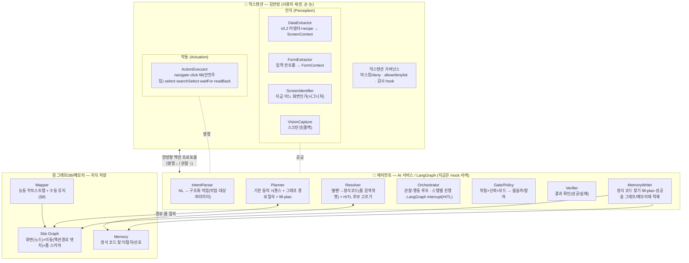
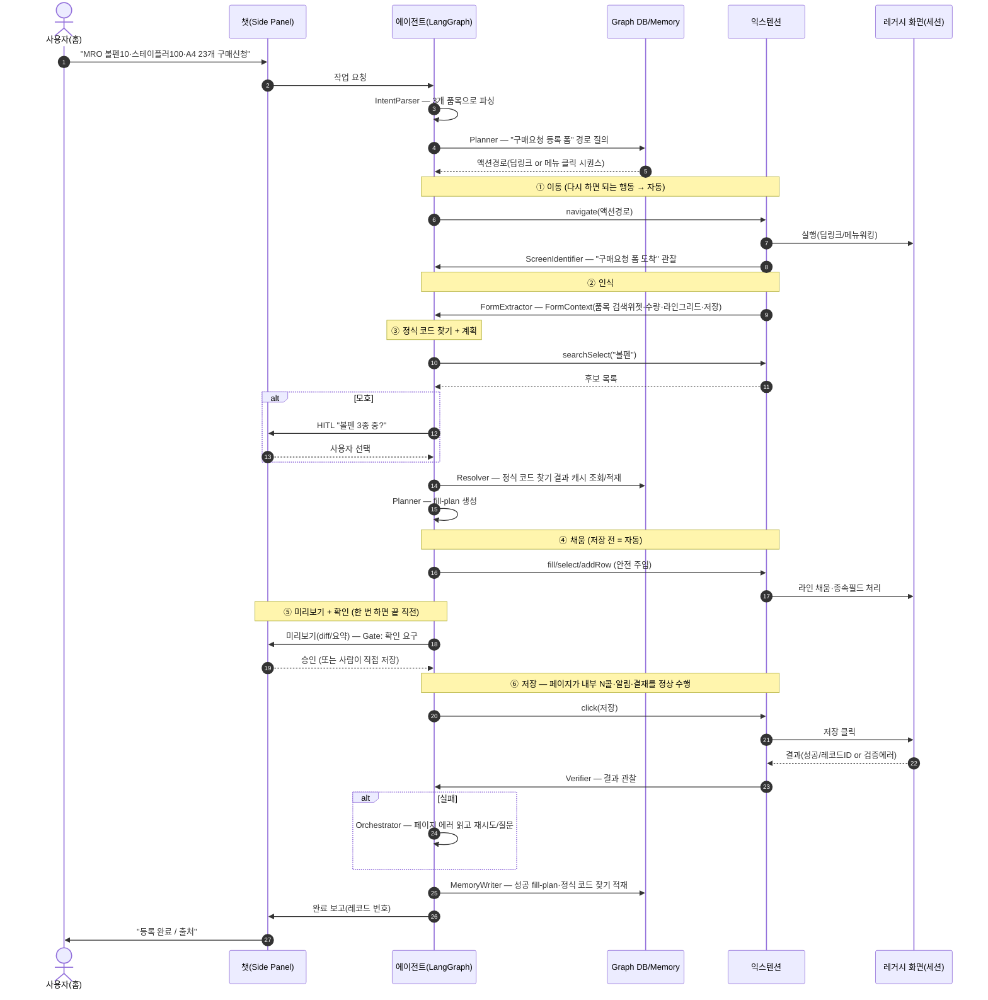
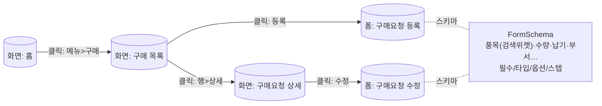
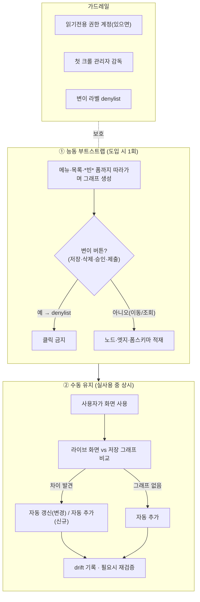

# 아키텍처 v0.4 — 행동 에이전트 (김반장)

> 화면을 *읽고 답하던* 챗봇(v0.2/0.3)을, **사용자 대신 화면을 조작해 조회·수정·등록·삭제까지 수행하는 에이전트**로 확장한다.
> 용어는 [glossary.md](../glossary.md), 이전 단계는 [v0.3-direction.md](v0.3-direction.md).
> 이 문서는 *방향·설계 합의*다(미구현). 구체 구현 시 모듈별 설계로 분화한다.

---

## 0. 한 줄 / 목표 / 무기

- **한 줄:** 에이전트는 통합(integration)하지 않는다. **사용자의 살아있는 로그인 세션에서 실제 UI를 조작**한다 — 에이전트(LangGraph)는 *계획*만, 손·눈은 익스텐션(김반장)이 *실제 화면*에서 움직인다.
- **목표:** 클로드 인 크롬 수준의 범용 브라우저 행동 + **사내 도메인 최적화**.
- **무기(클로드 인 크롬이 못 하는 것):**
  1. **사내 시스템 지식 그래프** — 범용 모델엔 *없는* 우리 레거시의 메뉴·화면·폼 지식을 그래프로 축적(§7).
  2. **도메인 정식 코드 찾기(grounding)** — "볼펜 → 정식 품목코드", 결재 규칙 등을 회사 데이터에서 찾기(§4·§5).
  3. **엔터프라이즈 거버넌스** — 마스킹·감사·허용목록(§9). 범용 제품이 안 해주는 것.
- **액션층은 직접 소유**한다(범용 루프는 상품화됨). [nanobrowser](https://github.com/nanobrowser/nanobrowser)(Apache-2.0)의 검증된 해법을 **참고**해 단단히 만든다(§10).

---

## 1. 핵심 결정 — 왜 "API"가 아니라 "실제 UI 조작"인가 (결정 기록)

세 후보를 검토하고 **UI 조작(실제 버튼 클릭)** 으로 결정했다. 근거를 남긴다.

| 방식 | 무결성 | 인증 | 레거시 무수정 | 치명적 단점 |
|---|---|---|---|---|
| **API/MCP 직접 호출** | ⚠️ 깨질 위험 | ❌ 토큰 책임 | △(기존 API면 OK) | 화면·화면전용 서버(BFF)에만 있는 **검증·파생·워크플로 건너뜀**. 저장 시 발생하는 **중간 이벤트(알림 발송·결재 라우팅·채번 등)가 누락**됨 |
| **API 콜 관찰·재현** | ⚠️ 시퀀스 누락 | △ | ✅ | 단일 콜만 재현 시 *상태 있는 시퀀스* 깨짐. 암호화 페이로드면 불가 |
| **UI 조작(버튼 클릭)** ★ | ✅ 페이지가 전부 수행 | ✅ 세션 상속·새 인증 0 | ✅ 코드 무수정 | DOM 취약·느림·대량 불리 → 채움·검증 난이도로 이동 |

**결정 이유 (핵심):** 사용자가 누르듯 **진짜 "저장"을 클릭하면, 내부에서 여러 API가 불리고 알림·결재·채번 같은 *중간 이벤트가 전부 정상 발생*** 한다. API를 직접/재현 호출하면 바로 이 이벤트들이 **누락**된다 — 이것이 API를 버린 결정타다. 또 세션을 그대로 타므로 인증·CSRF 책임이 사라진다(브라우저 안에서 실행하기 때문).

**비용은 사라지지 않고 *옮겨간다*:** "저장"의 무결성은 공짜로 얻지만, 난이도가 **"클릭 전에 폼을 *올바른 상태*로 만들기"** 로 이동한다(controlled input·종속 필드·위저드). 여기를 §3 액션층이 담당한다.

**인식은 DOM 우선, 비전은 폴백:** DOM/구조는 결정론·저비용·테스트 가능. 비전(스크린샷)은 *처음 보는·이상한 UI*도 보지만 느림·비싸므로 **막혔을 때만**. (egress가 Anthropic·Azure로 이미 승인된 경계라 비전 도입에 거버넌스 장벽은 없음 — §9)

---

## 2. 행동 분류 & 게이트 (쉬운 말)

행동을 두 종류로만 나눈다:

- **다시 하면 되는 행동** — 보기·이동·검색·입력폼 *채우기만*(저장 전). 틀려도 다시 하면 됨 → **마음껏 자동.**
- **한 번 하면 끝인 행동** — 저장·삭제. 누르면 못 되돌림 → **신중.**

매 행동 앞에 **게이트**가 "물어볼까/그냥 할까"를 결정한다:

```
gate(action) = f( 위험등급, 신뢰도, 모드 )
  위험등급  : 다시 하면 되는 / 한 번 하면 끝
  신뢰도    : 기억(그래프·메모리)에서 온 — 이 결정, 이 맥락에서 과거 성공/확인 횟수
  모드      : default | auto-fill | bypass
  → 신뢰도 ≥ 임계(위험등급·모드별) 면 실행, 아니면 HITL
```

- 이 게이트 하나가 **HITL · 메모리 기반 자율 · bypass(클로드 코드식)** 를 통일한다.
- **마찰의 진짜 원인은 "마지막 저장 1번"이 아니라 "중간의 잦은 확인들"**(이 품목 맞아? 이 코드 맞아?) → **에이전트가 그래프 DB·메모리에 경험을 쌓을수록 이 잦은 확인이 줄어든다.** "다시 하면 되는" 쪽은 공격적으로 자율화하고, **"한 번 하면 끝"인 것만 비례적·가벼운 확인**(금액 상한 내 자동, 초과 시 확인)으로 남긴다. 단, 신뢰도가 아무리 높아도 *틀렸을 때의 비용*까지 줄여주지는 못하므로, 되돌릴 수 없는 행동의 자율화는 0으로 만들지 않는다.

---

## 3. 컴포넌트 아키텍처 — 모듈과 역할·책임



**모듈 역할·책임 (한 줄씩)** — *영역*은 그 모듈이 어디 사는지다: **익스텐션**=김반장(브라우저 속 손·눈), **에이전트**=AI 서비스/LangGraph(계획·판단), **그래프DB/메모리**=지식 저장.

| 영역 | 모듈 | 역할 | 책임 경계(하지 않는 것) |
|---|---|---|---|
| 익스텐션·인식 | **DataExtractor** | 화면 *데이터* 추출(표/카드/차트) → ScreenContext (v0.2) | 화면을 읽기만 한다. 클릭·이동은 하지 않는다. |
| 익스텐션·인식 | **FormExtractor** | *입력 컨트롤* 추출 → FormContext(필드·타입·옵션·버튼) | 어떤 입력칸이 있는지 파악만 한다. 값을 채워 넣지는 않는다. |
| 익스텐션·인식 | **ScreenIdentifier** | "지금 어느 화면" 판정(도착 감지) | 화면이 무엇인지 알아보기만 한다. 읽기용 recipe와 섞지 않는다(역할 분리). |
| 익스텐션·인식 | **VisionCapture** | 스크린샷 제공(폴백) | DOM으로 안 보일 때만 쓰는 보조 수단이다. 평소엔 쓰지 않는다. |
| 익스텐션·작동 | **ActionExecutor** | 기본 동작(primitive) 실행 — 클릭·**폼 값 입력(실제로 칸에 써넣음, 안전 주입)**·선택·검색·대기·되읽기 | 시키는 동작을 수행만 한다. *무엇을* 할지(어느 칸에 무슨 값)는 에이전트(Planner)가 정한다. |
| 익스텐션·거버넌스 | **GovernancePlane** | 마스킹·allow/denylist·감사 | 가리고·막고·기록만 한다. 업무 내용 자체를 판단하지는 않는다. |
| 에이전트 | **IntentParser** | 자연어 → 구조화 작업 | 사용자 말을 구조로 바꾸기만 한다. 실제 행동은 하지 않는다. |
| 에이전트 | **Planner** | 시퀀스·경로·*검사 가능한 fill-plan* 생성 | 계획만 세운다. 화면을 직접 누르지는 않는다. |
| 에이전트 | **Resolver** | 모호 항목 → 정식 코드 찾기(+HITL) | 모호한 말을 정식 코드로 바꾸기만 한다. 폼에 입력하지는 않는다. |
| 에이전트 | **Orchestrator** | 관찰-행동 루프·스텝 진행·HITL 멈춤/재개 | 전체 진행을 지휘한다. 클릭·입력 같은 동작을 직접 만들지는 않는다(익스텐션이 함). |
| 에이전트 | **Gate/Policy** | 물을까/할까 결정 | 물을지 그냥 할지만 정한다. 실제 행동은 하지 않는다. |
| 에이전트 | **Verifier** | 결과 검증·실패 회수 | 결과가 맞는지 확인만 한다. 다시 계획 짜는 일은 Orchestrator에 맡긴다. |
| 에이전트 | **MemoryWriter** | 성공·정식 코드 찾기·계획 적재 | 기억에 쓰기만 한다. 기억을 꺼내 쓰는 건 Planner/Resolver가 한다. |
| 그래프DB/메모리 | **Site Graph** | 화면·이동·폼 지식 보관 | 지식을 보관만 한다. 직접 행동하지는 않는다. |
| 그래프DB/메모리 | **Memory** | 정식 코드 찾기/절차/선호 누적 | — |
| 그래프DB/메모리 | **Mapper** | 그래프 생성·유지(§8) | 그래프를 만들고 갱신만 한다. 저장·삭제처럼 *바꾸는 버튼은 절대 누르지 않는다*. |

> **핵심 축(linchpin) = fill-plan.** Planner는 폼을 바로 채우지 않고 **"어느 필드에 무슨 값"의 *검사 가능한 계획*** 을 먼저 만든다. 이 하나가 **안전**(실행 전 확인)·**HITL**(계획 검토)·**테스트**(브라우저 없이 FormContext→plan 단위테스트)·**실행/계획 분리**(UI든 미래 API든 교체 가능)를 동시에 푼다.

---

## 4. 실행 순서 (등록 작업 예시) — 모듈별 역할이 드러나는 시퀀스



---

## 5. 모든 요청 타입 — 하나의 루프 + 공통 기본 동작

"등록 봇"이 아니다. **조회·수정·등록·삭제·승인이 *같은 루프*** 로 흐른다. 다른 건 "어떤 기본 동작(primitive)을 쓰나"와 "마지막에 *저장*이 있나"뿐.

```
공통 루프: 요청 이해 → 대상 화면 도달(이동) → 화면 인식 →
           필요 행동(읽기/채우기/바꾸기/클릭) → 필요시 확인 → 결과 보고
```

| 요청 | 핵심 기본 동작 | 한 번 하면 끝? | 도입 순서·이유 |
|---|---|---|---|
| **조회** | navigate·search·read | 없음 | **1순위** — 가장 안전·빈번, v0.2 읽기 재활용 |
| **수정** | navigate·read(기존)·fill(diff)·save | 1번 | 2순위 — 기존 레코드 기반이라 채울 게 적고 *diff 확인이 자연스러움* |
| **등록** | navigate·fill·save | 1번 | 3순위 |
| **삭제·승인** | navigate·search·click·confirm | 매우 신중 | 4순위 — 가장 높은 게이트 |

→ 별도 플로우 N개가 아니라 **기본 동작 모음 + 계획자(LLM)** 가 요청마다 조립. **"한 번 하면 끝" 게이트는 실제 저장이 있는 곳에만** 붙는다.

---

## 6. 네비게이션 — 길은 주되, 상태를 보며 간다

에이전트는 *대본*이 아니라 **상태(화면)를 보고 한 스텝씩** 정한다. 누가 이동했든(자동/사람) **"도착"만 감지**하면 이어간다.

**3단 폴백**

1. **딥링크** 있으면 → 직행.
2. **없으면(웹스퀘어 등) → 메뉴 자동 조작**: Site Graph의 *액션 경로*(대>중>소 메뉴 클릭 시퀀스)를 따라감.
3. **막히면 → 사람에게 한 단계 넘김**: "구매요청 화면으로 가주세요." → ScreenIdentifier가 도착 감지 → 이어받음. (메뉴 이동은 *사람이 제일 잘함*)

**사용자 화면에서 직접 이동(관찰 가능):** 에이전트가 *목적 화면으로 직접 이동*하고, 그 과정을 사용자가 *눈으로 본다*. 되돌릴 수 없는 단계나 모호한 지점에서는 **사용자가 관찰·확인**하고, 필요하면 사용자가 직접 한 단계 진행한다(위 3단 폴백).

> 백그라운드 탭에서 몰래 처리하는 방식은 *쓰지 않는다* — 엔터프라이즈 단일세션·서버 상태 가정과 충돌하고, 무엇보다 **사용자의 관찰·감독 기회를 없애기** 때문이다. 화면 이동이 사용자의 흐름을 끊을 수 있으니 작업 시작·완료를 챗으로 안내한다.

**모듈 분리 원칙:** 네비게이션 맵 · 화면 식별 · 액션 프로파일은 **v0.2 recipe와 별도 모듈**이다(역할 오염 금지). 저수준 "DOM 매칭 유틸"만 공유하고 *설정 아티팩트는 분리*.

---

## 7. 지식 그래프 — 우리의 무기 (모델에 없는 *사내 사전 지식(priors)*을 쌓는다)

범용 모델은 GitHub는 알아도 *사내 구매시스템*은 모른다. 그 빈자리를 **그래프로 채운다.**



- **노드 = 화면/상태**(목록·상세·폼). **엣지 = 이동(액션 경로)** — 딥링크가 없으니 *URL이 아니라 "클릭 시퀀스"* 로 주소를 잡는다.
- **폼 노드 = 필드 스키마**(검색위젯 여부·필수·옵션·스텝) → Planner가 fill-plan 생성에 사용.
- **네비게이션 = 그래프 경로 탐색**(현재 노드 → 목표 폼 최단 경로) → *블라인드 탐색이 아니라 결정론적*.
- **권한 변이:** 관리자 그래프 ≠ 일반 사용자 화면 → 역할별 서브그래프 고려.
- **저장소:** 바닥부터 만들지 말고 Neo4j 등 그래프DB + 메모리 레이어(Mem0/Zep) 재사용 검토.
- 이 그래프는 v0.6 **Agent Memory**의 토대이기도 하다.

---

## 8. 지속 업데이트 — 능동 부트스트랩 + 수동 유지

신규 도입 시스템을 **빨리 덮으려면** 능동이 필요하고, **틀어짐을 따라가려면** 수동이 필요하다. 둘을 합친다.



- **능동은 "이동만"(읽기 전용):** 메뉴·목록·*빈 폼 도달*은 안전(폼 스키마 수집 OK). **폼 제출·저장·삭제·승인·행별 액션은 절대 금지** → 변이 라벨 denylist.
- **수동 유지 = 안전한 자가성장:** 실사용 중 *라이브 vs 저장 그래프 diff* 만 자동 반영(없으면 자동 추가, 바뀌면 자동 갱신). 화면 변경·신규 추가를 *쓰면서* 따라잡는다.
- **선택적 수동 업데이트 기능**도 별도 제공(관리자가 특정 화면을 명시적으로 재학습).
- **drift 감지:** 그래프대로 갔는데 도착 못 하면 그 엣지를 의심·재학습.

---

## 9. 거버넌스 · 안전 (가로지르는 1급 평면)

- **세션 권한 상속:** 에이전트는 *사용자가 할 수 있는 것만* 한다(새 인증 0). 권한 상승 없음.
- **마스킹/deny:** 민감값은 *익스텐션을 떠나기 전* 가린다. egress(Anthropic·Azure)는 승인 경계지만 정책상 특정 필드(단가·주민번호)는 redaction.
- **Allowlist / Denylist:** 행동 허용 시스템·폼 목록 / *절대 누르면 안 되는 버튼* 목록.
- **미리보기 + 확인 + (기본) 사람이 저장:** 되돌릴 수 없는 행동은 fill-plan 미리보기 후 승인. 강한 정책은 *최종 저장만 사람이*.
- **감사 로그:** 누가·무엇을·언제·무슨 값으로. bypass의 안전망.
- **프롬프트 인젝션 가드:** 페이지 텍스트는 *데이터*지 *지시*가 아니다.
- **bypass 모드:** "다시 하면 되는" 행동엔 관대, "한 번 하면 끝"엔 금액 상한·폼별 opt-in.

---

## 10. nanobrowser에서 *참고*할 것 (소유는 우리, 지혜는 빌린다)

[nanobrowser](https://github.com/nanobrowser/nanobrowser) (Apache-2.0, 비-copyleft, TS/MV3, Planner·Navigator 멀티에이전트). 우리는 *코드를 통째로 흡수*하지 않고 **검증된 해법을 참고**해 우리 액션층을 단단히 한다:

- **MV3 서비스워커 수명** — 긴 다단계 루프 vs SW 종료를 어떻게 견디나(offscreen/keep-alive/상태 저장).
- **인터랙티브 요소 추출·인덱싱** — 클릭 대상에 안정적 핸들을 부여하는 방식.
- **액션 실행 신뢰성** — controlled input 안전 주입, 대기/재시도 패턴.
- **멀티에이전트 분리**(Planner/Navigator) — 단, 우리는 *에이전트를 서버/LangGraph로* 둔다(nanobrowser는 in-browser).
- ⚠️ 라이선스 표기 의무 준수(사본 포함·변경 표기).

---

## 11. 미해결 가정 · 리스크 (정직하게)

| 가정/리스크 | 영향 | 대처 |
|---|---|---|
| 에이전트 화면 이동이 사용자 흐름 방해 | 작업 중단감 | 시작·완료를 챗으로 안내, 관찰·확인 단계 제공 |
| 딥링크 존재? | 이동 비용·신뢰도 | 없으면 메뉴맵·사람 핸드오프 |
| 위젯에 안정적 handle? | 채움·클릭 신뢰도 | 없으면 비전 폴백/HITL |
| 비전 비용·비결정성 | 대량·되돌릴 수 없는 작업 | 기본 DOM, 비전은 폴백 |
| 능동 크롤 오클릭 | 실 트랜잭션 발생 | 읽기권한·denylist·감독 |
| 그래프 drift | 잘못된 이동 | 수동 diff·재검증 |

---

## 12. 단계 로드맵 (위험 낮은 데서 가치 먼저)

1. **통제된 데모 폼**에서 액션층 *최소 PoC*: 안전입력 + 클릭 + 도착감지 + fill-plan 미리보기 + HITL + 검증. (브라우저 없이도 fill-plan 생성은 결정론 테스트)
2. **조회**(저장 없음) — 이동·검색·읽기. v0.2 재활용. 가장 안전.
3. **수정** — 기존 레코드 diff. "한 번 하면 끝" 게이트 첫 도입.
4. **등록** → **삭제·승인** — 게이트 상향.
5. **지식 그래프 + 능동 부트스트랩 + 수동 유지** 가동 → 도입 시스템 확장.
6. **메모리로 잦은 확인 제거**(→ v0.6 자기개선과 합류).
